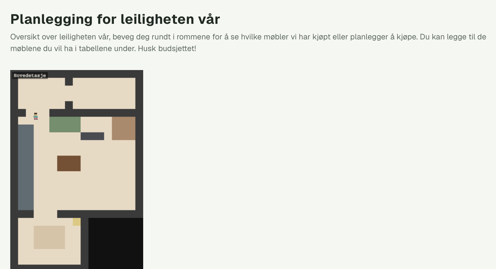
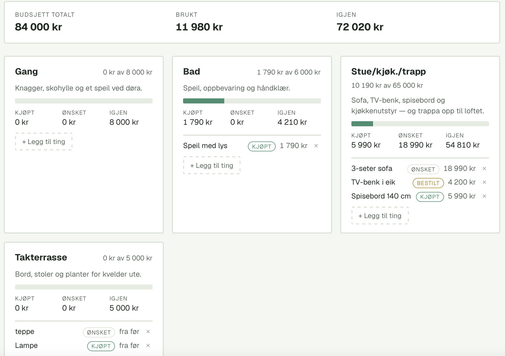

# Leilighetsplanlegger

En liten pixel-art planlegger for leiligheten vår. Kartet over leiligheten er et
Phaser-spill du kan gå rundt i, og under kartet ligger rompanelene med budsjett
og lista over ting vi har kjøpt eller ønsker oss. Møblene på kartet tegnes ut fra
tingene i databasen — legger du til en sofa i lista, dukker den opp i stua.



## Kom i gang

```bash
npm install
npm run dev
```

Appen kjører på http://localhost:3000.

Uten Supabase-variablene starter appen på mockdata i minnet — fint for å prøve
seg fram, men alt du legger inn forsvinner når serveren restarter. `.env.local`:

```
APP_PASSWORD=...
NEXT_PUBLIC_SUPABASE_URL=...
NEXT_PUBLIC_SUPABASE_ANON_KEY=...
```

`APP_PASSWORD` er passordet som slipper deg inn (se [Passord](#passord)) og må
settes — uten den er appen stengt, ikke åpen.

Migrasjonene i `supabase/migrations/` setter opp `items`-tabellen. `rooms` har
ingen migrasjon ennå — den tabellen finnes bare i det kjørende Supabase-prosjektet,
så et helt nytt prosjekt må få den satt opp for hånd først. I mock-modus kommer
rom og ting fra `server/repositories/mockStore.ts`.

Andre skript:

```bash
npm run build   # produksjonsbygg
npm run start   # kjører produksjonsbygget
npm run lint    # eslint
```

## Passord

Appen har ett delt passord og ingen brukerkontoer. `proxy.ts` (het `middleware.ts`
før Next 16) står foran alt: uten en gyldig økt sendes sider til `/login`, og
API-kall får `401` — også `POST /api/items`, så ingen kan skrive utenom
innloggingen.

## Sånn henger det sammen

Data går alltid samme vei, og hvert lag kjenner bare laget under seg:

```
UI / spill  →  client-service  →  API-route  →  server-service  →  repository  →  Supabase / mock
```

| Mappe | Ansvar |
| --- | --- |
| `app/` | Sider og API-routes. Routene oversetter bare mellom HTTP og service-laget — ingen forretningslogikk, ingen databasekall. |
| `components/` | React-UI: rompanelene (`RoomList`), skjemaet for nye ting (`AddItemForm`), spillcanvaset (`GameCanvas`) og temabryteren. |
| `game/` | Phaser-laget: plantegningen (`apartment.ts`), scenen (`ApartmentScene.ts`), spilleren og møbeltegningen (`furniture.ts`). |
| `services/` | Client-services. UI og spill kaller disse i stedet for `fetch` direkte, så endepunkt-URL-ene ligger ett sted. |
| `server/services/` | Forretningslogikken: validering og budsjettutregning. |
| `server/auth/` | Passordsjekk og signering av økt-cookien. |
| `server/repositories/` | Eneste laget som snakker med en datakilde. `index.ts` velger mock eller Supabase ut fra miljøvariablene. |
| `types/` | Delte modeller (`Room`, `Item`, `Budget`, møbeltyper). Kjenner ikke til datakilden. |
| `supabase/` | SQL-migrasjoner. |

Et par ting som er verdt å vite:

- **Budsjett lagres aldri, det regnes ut.** `Budget` er alltid derivert fra
  tingene i rommet, så tallene i panelet og i topplinja kan ikke komme i utakt.
  Etter en lagring henter UI-et rom og ting på nytt i stedet for å telle selv.
- **`item.kind` styrer kartet.** En ting med møbeltype tegnes i spillet; en ting
  uten vises bare i lista. Størrelse og farge per type ligger i `game/furniture.ts`.
- **Repository-byttet er poenget med lagdelingen.** Mock og Supabase
  implementerer samme kontrakt (`server/repositories/types.ts`), så ingenting
  over repository-laget merker hvilken som er i bruk.

## Bruk

Gå rundt med **piltastene** eller **WASD**. Går du inn i trappa i hjørnet av
stua, bytter du etasje til sovehemsen — og motsatt vei igjen. Tastaturet slipper
taket når du skriver i et skjemafelt, så du kan skrive «sofa» uten at figuren
løper av gårde.

Under kartet ligger ett kort per rom med budsjettlinje, hva som er kjøpt,
bestilt og ønsket, og lista over tingene. **+ Legg til ting** åpner skjemaet,
og `×` sletter (med bekreftelse).



## Skjermbilder

Bildene i README-en ligger i `docs/images/`. Legg nye bilder der og lenk dem inn
med `` — for eksempel et bilde av
rompanelene under kartet, eller sovehemsen.
